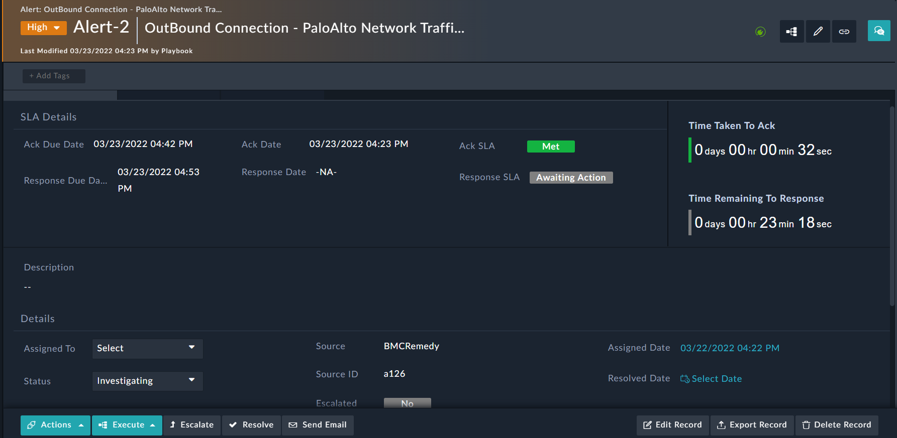

[Home](../README.md) |
 | -------------------------------------------- |

# Usage

FortiSOAR&trade;'s **SLA Management** solution pack contains playbooks that automatically track the SLAs of alerts, incidents, and other out-of-the-box playbooks for various use cases. The **SLA Calculator** connector calculates the SLA due dates based on the locale and work hours that you have specified.

## Working with SLA Templates

The **SLA Management** solution pack contains SLA templates for each severity level defined for incidents and alerts. There are templates for the following severity levels:

- Critical
- High
- Medium
- Low
- Minimal

You can set SLAs for both alerts and incidents using the same **_SLA Template_**.

To view or edit existing SLA templates:

1. Click **Automation**  **SLA Templates** from the left navigation bar.

2. Click an SLA template to view or edit. For example, click **High** to edit SLA parameters for alerts and incidents whose severity is set to **_High_**.

    

    Once opened, notice the following:

    - **Pause Incident SLA On**/**Pause Alert SLA On**: This field displays the alert and incident status that triggers the playbooks to pause the SLA timer.

        Pause SLAs are tracked on change of incident status to _`Awaiting`_ and alert status to _`Pending`_.

    - **Incident Ack Time**/**Alert Ack Time**: This field displays the time to acknowledge an incident or alert and is set to **20** minutes.

        Acknowledgment SLAs are tracked on change of incident status to _`In Progress`_ and alert status to _`Investigating`_.
    
    - **Incident Response Time**/**Alert Response Time**: This field displays the time to respond to an incident or alert and is set to **30** minutes.

        Response SLAs are tracked on change of incident status to _`Resolved`_ and alert status to _`Closed`_.

        <table>
            <tr>
                <th>NOTE</th>
                <td>Changes in SLA values are implemented in real time.</td>
            </tr>
        </table>

## Viewing SLAs on a record

You can view the SLA values in the detail-view of an alert or incident record. The detail-view displays information such as *Ack Due Date*, *Ack Date*, *Ack SLA*, and *Response Due Date* to track if the SLAs have been met.

1. Click **Automation**  **SLA Templates** from the left navigation bar.

2. Select to open an alert record to view the SLA status, i.e., whether they have been met, missed, or awaiting some action.

    The following example image displays an alert with SLA timers. Notice the following:

    - The **Ack SLA** for an alert with **High** severity has been **Met**
    - The response SLA timer is running at 23 minutes 18 seconds
    - The **Response SLA** it is set to **Awaiting Action**
    - The status of this alert is set to **Investigating** which is why the acknowledgment SLA is met
    - Response SLA will change to **Met** or **Missed** depending on when the alert status is set to **Closed** after investigation

# Next Steps
| [Installation](./setup.md#installation) | [Configuration](./setup.md#configuration) | [Contents](./contents.md) |
| ----------------------------------------- | ------------------------------------------- | --------------------------- |